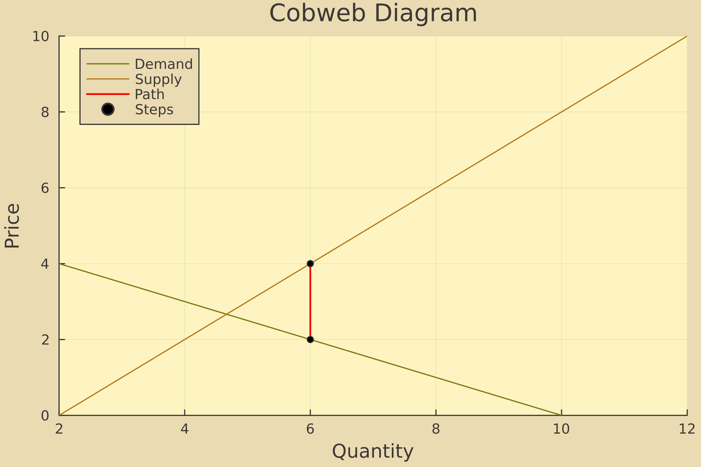
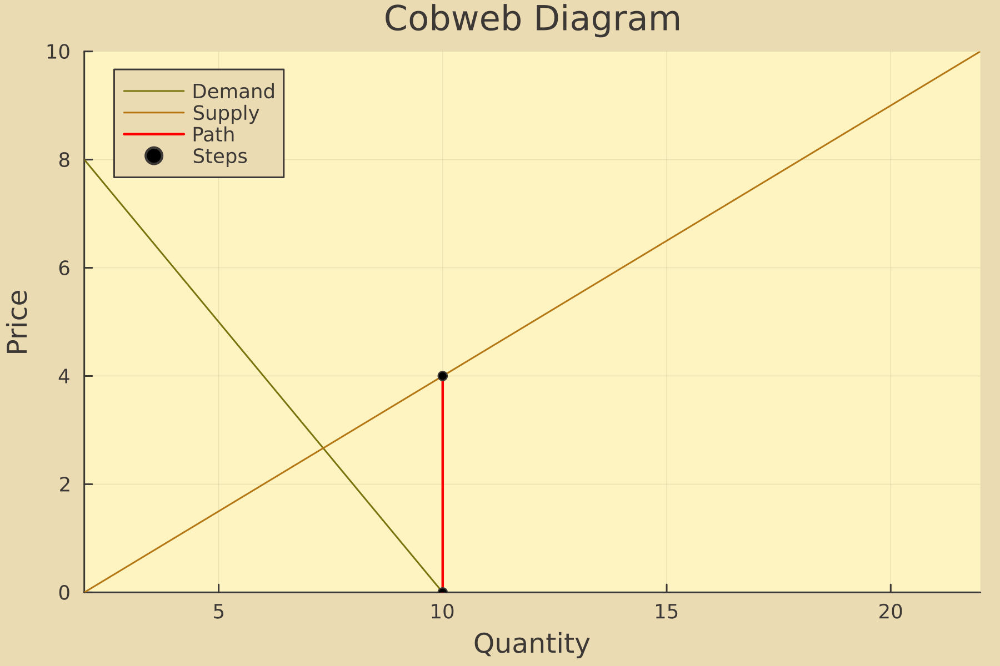

# Cobweb Model: Stability, Shocks, and Impulse Responses

This project implements a stochastic cobweb model in Julia, based on Walter Enders’ *Applied Econometric Time Series*. The model illustrates price and quantity dynamics in a market with production lags, focusing on stability, stochastic shocks, and impulse response functions (IRFs).

## Theoretical Background

The cobweb model, often applied to agricultural markets, assumes farmers use naive expectations: the expected price at time $t$ is the previous period’s price $( p_t^* = p_{t-1} )$. The model is defined by:

- **Demand**: $d_t = a - \gamma p_t$, where $\gamma > 0$.
- **Supply**: $s_t = b + \beta p_{t-1} + \varepsilon_t$, where $\beta > 0$, and $\varepsilon_t \sim N(0, \sigma^2)$ is a supply shock.
- **Market Clearing**: $s_t = d_t$.

Combining these, the price dynamics follow a first-order difference equation (Enders, Eq. 1.39):

$$
p_t = \left(-\frac{\beta}{\gamma}\right) p_{t-1} + \frac{a-b}{\gamma} - \frac{\varepsilon_t}{\gamma}
$$

- **Stability Condition**: The system is stable if $|\beta/\gamma| < 1$, leading to convergence to the equilibrium price $(a-b)/(\gamma+\beta)$.
- **Impulse Response**: The IRF (Enders, Eq. 1.46) traces the effect of a supply shock: $\partial p_{t+j}/\partial \varepsilon_t = (-1/\gamma) (-\beta/\gamma)^j$.

This project simulates:
1. Stable Cases (β/γ = 0.5):
   - A deterministic scenario showing convergence to the equilibrium price.
   - A stochastic scenario with supply shocks, analysing bounded fluctuations and the impulse response function (IRF).

2. Unstable Cases (β/γ = 2.0):
   - A deterministic scenario demonstrating divergence.
   - A stochastic scenario with supply shocks, showing explosive behaviour and the corresponding IRF.

## Results

### Stable Cases $(\beta/\gamma = 0.5)$
1. **Deterministic Model**: 
   - Prices and quantities converge to the equilibrium.
   

   - Price-quantity adjustments spiral inward to the equilibrium.
   

2. **Stochastic Model**: 
   - Prices fluctuate around the equilibrium with supply shocks $(σ=0.1)$.
   

   - The IRF shows price responses to a supply shock oscillating and decaying to zero, consistent with $ \beta/\gamma < 1 $.
   

### Unstable Cases $(\beta/\gamma = 2.0)$
1. **Deterministic Model**: 
   - Prices diverge/explode due to $|\beta/\gamma| > 1$.
   

   - Price-quantity adjustments spiral outwards away from the equilibrium.
   

2. **Stochastic Model**:
   - Prices diverge rapidly with shocks, as $\beta/\gamma = 2.0 > 1$, leading to unsustainable oscillations.
   

   - The IRF shows price responses growing exponentially, reflecting the unstable dynamics of $\beta/\gamma > 1$.
   

## Citation

The model and analysis are based on Enders, Walter. *Applied Econometric Time Series*. 4th ed., Wiley, 2014, pp. 18–22.

Key equations (1.35–1.39) define the model, the stability condition ensures convergence, and Eq. (1.46) provides the IRF.

## Notes

- The project uses Julia and runs in a Jupyter notebook (`cobweb_model.ipynb`).
- Parameters: $a = 10$, $b = 2$, stable case ($\gamma = 2 $, $\beta = 1$), unstable case stable case ($\gamma = 1 $, $\beta = 2$).
- Adjust $\sigma$ to explore shock impacts.
